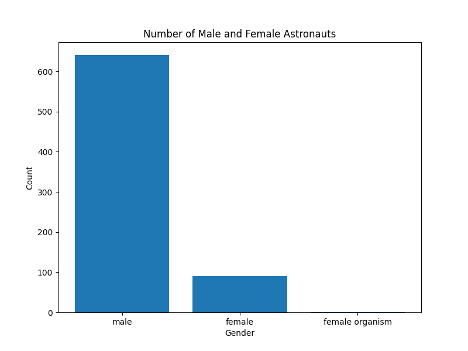

<!--
SPDX-FileCopyrightText: 2018 German Aerospace Center (DLR)
SPDX-License-Identifier: CC-BY-4.0
-->

# Astronaut Gender Count Project

This project is based on publicly available astronaut data from [Wikidata](https://www.wikidata.org/wiki/Wikidata:Main_Page). The script analyzes the data and displays the count of male and female astronauts in a bar chart.



## Repository Structure

The repository is organized as follows:

- [Data](Data): Contains the astronaut dataset in JSON format.
- [Code](Code): Contains the script for astronaut gender analysis.
- [Results](Results): Contains the generated analysis plots.

## Astronaut Data

The dataset was generated using a SPARQL query on Wikidata (retrieval date: 2018-10-25). To analyze recent data:

1. Run the SPARQL query on Wikidata.
2. Download the results in JSON format.
3. Replace the `Data/astronauts.json` file.
4. Re-run the analysis script to update the results.

## Astronaut Analysis Script

The script requires **Python >= 3.10** and uses the libraries [pandas](https://pandas.pydata.org/) (*BSD 3-Clause License*), [matplotlib](https://matplotlib.org/) (*Matplotlib License*), and the standard Python libraries `json`, `os`, and `collections.Counter`.

### Installation

Clone the repository and install the [required dependencies](Code/requirements.txt) as follows:

```bash
git clone https://github.com/mbernahr/astronaut-gender-project.git
cd astronaut-gender-project/Code
pip install -r requirements.txt
```

### Usage
Run the script as follows:

```bash
python count_astronauts_gender.py
```

The script processes the [astronauts dataset](Data/astronauts.json) and saves the generated bar chart in the `Results` directory. Existing result files will be overwritten.

### Contributors

- Marius Bernahrndt

